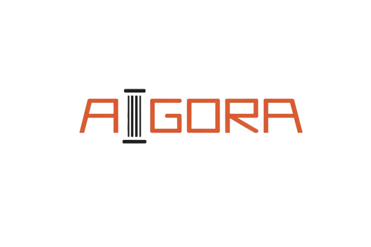

# AiGORA

A multi-agent bias assessment system for analyzing educational text and identifying structural bias through a dialectical, dimension-based workflow.



## Overview

AiGORA is an AI-powered application developed during the IPAI Hackathon.  
It is designed to analyze educational content for structural bias and support more inclusive text evaluation.

The system uses a multi-agent architecture to inspect text segments across different bias dimensions, aggregate findings, and present both qualitative and quantitative results in an interactive interface.

## Features

- Multi-agent bias assessment workflow
- Analysis of educational text for structural bias
- Dimension-based evaluation
- Interactive frontend built with React
- Quantitative metrics aggregation
- PDF text extraction
- Image-to-text extraction
- Dynamic dimension loading from project assets

## How It Works

AiGORA processes text through a structured pipeline:

1. **Input ingestion**  
   Users can provide plain text and extract text from uploaded PDFs or images.

2. **Segmentation and parsing**  
   The backend splits content into smaller text segments for analysis.

3. **Bias assessment**  
   Multiple agents evaluate the text across selected bias dimensions.

4. **Aggregation and metrics**  
   Results are combined into severity scores, dimension statistics, and visual summaries.

5. **Screenshots**  
   Users can inspect findings by dimension and segment inside the UI.


## Project Structure

```bash
.
├── agents/
├── assets/
│   └── dimensions/
├── src/
│   ├── components/
│   ├── services/
│   ├── App.tsx
│   ├── main.tsx
│   └── index.css
├── .env.example
├── MetricsAggregator.ts
├── server.ts
├── package.json
├── vite.config.ts
└── README.md

## Run Locally

**Prerequisites:**  Node.js


1. Install dependencies:
   `npm install`
2. Set the `GEMINI_API_KEY` in [.env.local](.env.local) to your Gemini API key
3. Run the app:
   `npm run dev`
